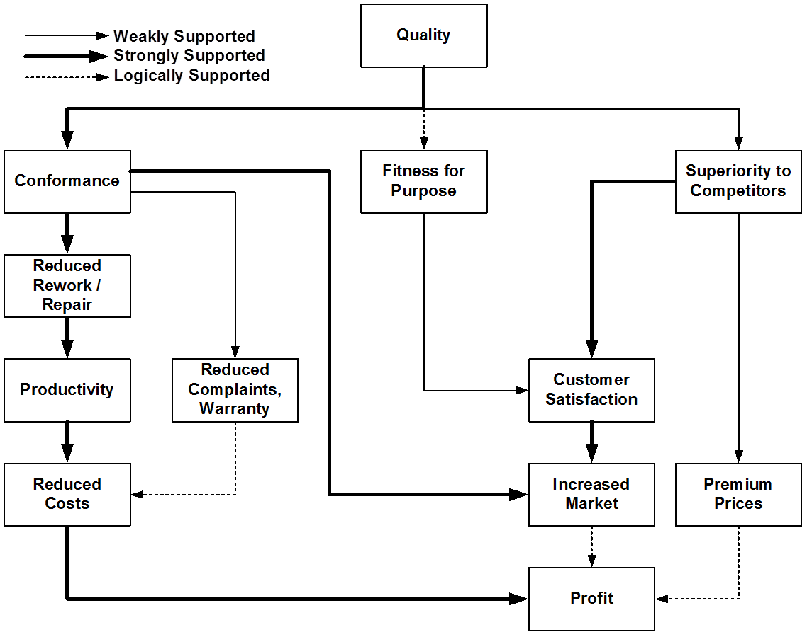

# Basic Statistics 1

Goals of Class

- Appreciate the importance of statistically examining products and processes

- Understand basic statistics

- Use software to perform "simple" statistical analyses

Outline

1. Introduction

2. Normal Distribution

3. Estimation of Parameters

4. Tests of Evaluation

5. Tests of Comparison

6. Planning Tests of Evaluation

## Introduction

### Some Quotes

"There are three kinds of lies:  lies, damned lies, and statistics."  [Sir Benjamin Disreali]

"Statistical thinking will one day be as necessary for efficient citizenship as the ability to read and write."  [H.G. Wells]

"It ain't so much the things we don't know that get us in trouble.  It's the things we know that ain't so."  [Artemus Ward]

"Round numbers are always false."  [Samuel Johnson]

"I have a great subject [statistics] to write upon, but I feel keenly my literary incapacity to make it easily intelligible without sacrificing accuracy and thoroughness."  [Sir Francis Galton]

From *How to Lie with Statistics* by Darrell Huff (1954)

*The Lottery:  A tax on people who are bad at math*

This is one of my favorite bumper stickers. If you are good a math, you might like this class. If you are not good a math, you probably will not like this class.  And maybe you should play the lottery more - we need the tax revenue.

### Statistics in Recent History

Modern statistics originated in Europe in the 19th century, primarily in France and Germany.  The Normal distribution, which we will discuss later, was developed by DeMoive and popularized by Gauss (and often called the Gaussian distribution).  The British further developed the field (and changed the name of the Gaussian distribution to the Normal distribution), primarily by Fisher, whose work in agriculture made its way to the U.S. and actually lead to the creation of the first U.S. statistics department at Iowa State University.

"One might even speculate that the second world war was won by quality control and by the utilization of modern statistics.  Certain statistical methods researched and utilized by the Allied Powers were so effective that they were classified as military secretes until the surrender of Nazi Germany"  [Ishikawa, *What is Total Quality Control*, p. 14-15, 1985]

Here's a picture of the old Zehn Deutsche Mark (10 DM) before the Euro.  Notice the Normal (Gaussian) curve in the middle.

http://www.kleinbottle.com/gauss.htm

"However, it was a little surprising for me to see that in the companies in the United States, where I visited for study, the methods and the concepts devised by Dr. Shewhart were not being applied very much in those days.  I wished to import his concepts into Japan. so that Japanese products would improve in quality.  The concepts of Dr. Shewhart had great influence on popularization of statistical quality control in Japan and on improvement in the quality of Japanese products."  [Ishikawa, AT&T Technical Journal, p. 17, 1986]

In the late 1940s and early 1950s, the U.S., lead by General McArthur, rebuilt Japan, primarily to stop the spread of communism.  McArthur brought in leading U.S. business and statistical thinkers, like Deming (a disciple of Shewhart) and Juran, to help.  The Japanese appreciated the usefulness of these techniques so much that they created the Deming Prize in 1950.

In the 1980s, many U.S. businesses realized they lost their competitive advantage to Japanese companies and wanted to find out how that happened.  One of the things they discovered was that the Japan were effectively using the statistical methods that Deming and Juran had taught in the 1950s, but the U.S. companies had either stopped utilizing them or never adopted them in the first place.  Somewhat ironically, the U.S. created the Baldridge award in 1987 in an attempt to emulate Japan's Deming Prize.

### "Statistic" versus "Statistics"

Statistic:  A value calculated from data sampled from a population that is used to make an inference about the population.

Statistics:  A body of tools, methods, and concepts that helps us to collect and present data in ways that facilitate the evaluation of current theories and stimulate the formation of new theories (Brian Joiner, 1990).

The only difference between these two terms is the letter "s"; however, they have very different meanings.  The first one is used to summarize **Data**.  The second one is used to help the journey from **Data** to **Information** to **Facts** to **Knowledge**. 

"It's not the figures themselves... it's what you do with them that matters."  K.A.C. Manderville, *The Undoing of Lamia Gurdleneck*

### The Scientific Method

Statistics means many different things to many different people:

- A generic field of technology

- A unique discipline using mathematics and probability theory as a tool and the scientific method as a philosophy

- The discipline responsible for studying the scientific method with the greatest intensity

- The science of making decisions in the face of uncertainty

- An aid to clear, disciplined thinking where the collection and interpretation of data are concerned

- A method of applying logic to problem diagnosis and solution using mathematical principles

- Useful in any field of application

- An aid to - but not a substitute for - good judgment

Statistics is used throughout the scientific method.  The aspect I like to stress the most is:  "An aid to - but not a substitute for - good judgment."  On one extreme, you should not ignore statistics and make decisions with out it.  One the other extreme, you should not blindly apply statistics to everything.  A blend of knowledge AND statistics is recommended.

[http://www.tomatosphere.org/EngManual/scientific_method9.html]

[http://home.ubalt.edu/ntsbarsh/opre640/opre640.htm]

### Benefits of Statistics

- Understand Data:  "In God we trust; others must have data"

- Understand Variation:  Variation = Anti-Quality

- Measure and understand Quality so that it can be improved

### Theoretical Relationship Between Quality and Performance

Quality has 4 popular definitions (in progressive order):

- Conformance to requirements

- Meets customer expectations

- Exceeds customer expectations

- Superiority to competitors

Whichever one you use, quality improvement *theoretically* leads to increased profits.

### Empirical Relationship Between Quality and Performance

Studies have shown that quality improvement can be directly linked to profits via conformance, fitness of purpose, or superiority to competitors.  This validates many of the linkages shown on the theoretical slide, but the relationships are not as strong.

### Quality Chain Reaction

I'm sure the importance of quality is obvious to everyone in this room, but some people still don't get it, and often they mistakenly think quality improvement will cost jobs.  If you encounter such people, you should inform them of Deming's Quality Chain Reaction [Deming, W.E., *Out of the Crisis*, 1986 (p. 3)].

While quality improvement and the resulting productivity improvement might eliminate the jobs of those paid to inspect, sort, or fire-fight, it's better than the alternative:  no jobs for everyone!

### Statistical Thinking and Statistical Methods

Statistical Thinking: A thought process that recognizes that

- All work is a process

- All processes contain **variability**

- Improvement comes from finding out
    + Where the **variation** is
    + What kinds of **variation** exist
    + How much **variation** there is
    + How the **variation** can be reduced

This approach is the foundation of Six Sigma.

### Role of Statistical Thinking

Deming's Message

- Reduce the **variation** and you improve quality
    + Customers want consistent products

- Understanding **variation** can help us:
    + Improve the system
    + Better satisfy our customers' needs

Have said all that, think of this class as how to make decisions in the presence of variation.

