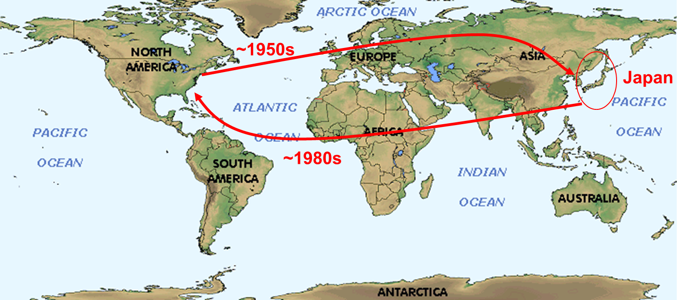
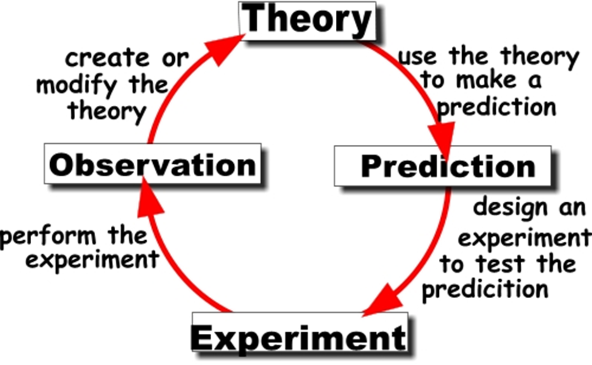
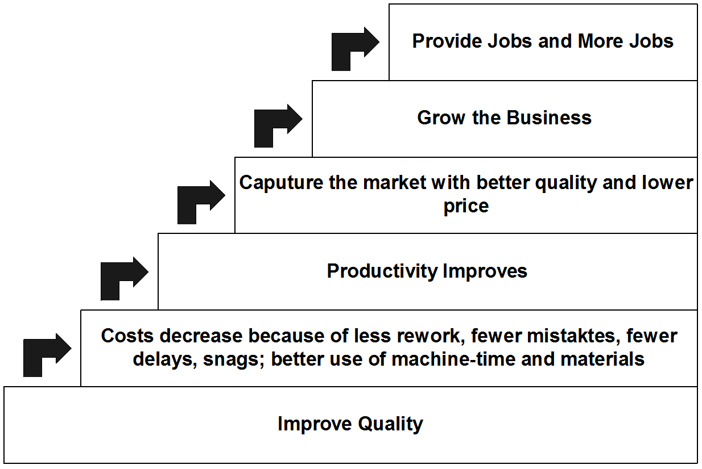
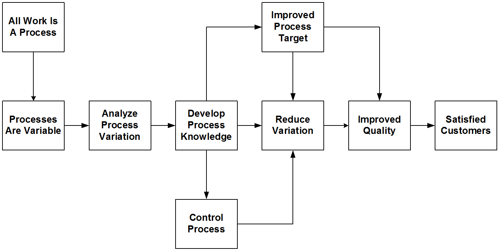

Basic Statistics 1
================
Robert A. Stevens
2021-10-12

## Goals of Class

-   Appreciate the importance of statistically examining products and
    processes

-   Understand basic statistics

-   Use software to perform “simple” statistical analyses

## Outline

1.  Introduction

2.  Normal Distribution

3.  Estimation of Parameters

4.  Tests of Evaluation

5.  Tests of Comparison

6.  Planning Tests of Evaluation

## Introduction

### Some Quotes

“There are three kinds of lies: lies, damned lies, and statistics.”
\[Sir Benjamin Disreali\]

“Statistical thinking will one day be as necessary for efficient
citizenship as the ability to read and write.” \[H.G. Wells\]

“It ain’t so much the things we don’t know that get us in trouble. It’s
the things we know that ain’t so.” \[Artemus Ward\]

“Round numbers are always false.” \[Samuel Johnson\]

“I have a great subject \[statistics\] to write upon, but I feel keenly
my literary incapacity to make it easily intelligible without
sacrificing accuracy and thoroughness.” \[Sir Francis Galton\]

From *How to Lie with Statistics* by Darrell Huff (1954)

*The Lottery: A tax on people who are bad at math*

This is one of my favorite bumper stickers. If you are good a math, you
might like this class. If you are not good a math, you probably will not
like this class. And maybe you should play the lottery more - we need
the tax revenue.

### Statistics in Recent History

Modern statistics originated in Europe in the 19th century, primarily in
France and Germany. The Normal distribution, which we will discuss
later, was developed by DeMoive and popularized by Gauss (and often
called the Gaussian distribution). The British further developed the
field (and changed the name of the Gaussian distribution to the Normal
distribution), primarily by Fisher, whose work in agriculture made its
way to the U.S. and actually lead to the creation of the first U.S.
statistics department at Iowa State University.

“One might even speculate that the second world war was won by quality
control and by the utilization of modern statistics. Certain statistical
methods researched and utilized by the Allied Powers were so effective
that they were classified as military secretes until the surrender of
Nazi Germany” \[Ishikawa, *What is Total Quality Control*, p. 14-15,
1985\]

Here’s a picture of the old Zehn Deutsche Mark (10 DM) before the Euro.
Notice the Normal (Gaussian) curve in the middle.

<http://www.kleinbottle.com/gauss.htm>

“However, it was a little surprising for me to see that in the companies
in the United States, where I visited for study, the methods and the
concepts devised by Dr. Shewhart were not being applied very much in
those days. I wished to import his concepts into Japan. so that Japanese
products would improve in quality. The concepts of Dr. Shewhart had
great influence on popularization of statistical quality control in
Japan and on improvement in the quality of Japanese products.”
\[Ishikawa, AT&T Technical Journal, p. 17, 1986\]

In the late 1940s and early 1950s, the U.S., lead by General McArthur,
rebuilt Japan, primarily to stop the spread of communism. McArthur
brought in leading U.S. business and statistical thinkers, like Deming
(a disciple of Shewhart) and Juran, to help. The Japanese appreciated
the usefulness of these techniques so much that they created the Deming
Prize in 1950.

In the 1980s, many U.S. businesses realized they lost their competitive
advantage to Japanese companies and wanted to find out how that
happened. One of the things they discovered was that the Japan were
effectively using the statistical methods that Deming and Juran had
taught in the 1950s, but the U.S. companies had either stopped utilizing
them or never adopted them in the first place. Somewhat ironically, the
U.S. created the Baldridge award in 1987 in an attempt to emulate
Japan’s Deming Prize.

### “Statistic” versus “Statistics”

**Statistic:** A value calculated from data sampled from a population
that is used to make an inference about the population.

**Statistics:** A body of tools, methods, and concepts that helps us to
collect and present data in ways that facilitate the evaluation of
current theories and stimulate the formation of new theories (Brian
Joiner, 1990).

The only difference between these two terms is the letter “s”; however,
they have very different meanings. The first one is used to summarize
**Data**. The second one is used to help the journey from **Data** to
**Information** to **Facts** to **Knowledge**.

“It’s not the figures themselves… it’s what you do with them that
matters.” K.A.C. Manderville, *The Undoing of Lamia Gurdleneck*

### The Scientific Method

Statistics means many different things to many different people:

-   A generic field of technology

-   A unique discipline using mathematics and probability theory as a
    tool and the scientific method as a philosophy

-   The discipline responsible for studying the scientific method with
    the greatest intensity

-   The science of making decisions in the face of uncertainty

-   An aid to clear, disciplined thinking where the collection and
    interpretation of data are concerned

-   A method of applying logic to problem diagnosis and solution using
    mathematical principles

-   Useful in any field of application

-   An aid to - but not a substitute for - good judgment

Statistics is used throughout the scientific method. The aspect I like
to stress the most is: “An aid to - but not a substitute for - good
judgment.” On one extreme, you should not ignore statistics and make
decisions with out it. One the other extreme, you should not blindly
apply statistics to everything. A blend of knowledge AND statistics is
recommended.

\[<http://www.tomatosphere.org/EngManual/scientific_method9.html>\]

\[<http://home.ubalt.edu/ntsbarsh/opre640/opre640.htm>\]

### Benefits of Statistics

-   Understand Data: “In God we trust; others must have data”

-   Understand Variation: Variation = Anti-Quality

-   Measure and understand Quality so that it can be improved

### Theoretical Relationship Between Quality and Performance

Quality has 4 popular definitions (in progressive order):

-   Conformance to requirements

-   Meets customer expectations

-   Exceeds customer expectations

-   Superiority to competitors

Whichever one you use, quality improvement *theoretically* leads to
increased profits.

### Empirical Relationship Between Quality and Performance

Studies have shown that quality improvement can be directly linked to
profits via conformance, fitness of purpose, or superiority to
competitors. This validates many of the linkages shown on the
theoretical slide, but the relationships are not as strong.

### Quality Chain Reaction

I’m sure the importance of quality is obvious to everyone in this room,
but some people still don’t get it, and often they mistakenly think
quality improvement will cost jobs. If you encounter such people, you
should inform them of Deming’s Quality Chain Reaction \[Deming, W.E.,
*Out of the Crisis*, 1986 (p. 3)\].

While quality improvement and the resulting productivity improvement
might eliminate the jobs of those paid to inspect, sort, or fire-fight,
it’s better than the alternative: no jobs for everyone!

### Statistical Thinking and Statistical Methods

Statistical Thinking: A thought process that recognizes that

-   All work is a process

-   All processes contain **variability**

-   Improvement comes from finding out

    -   Where the **variation** is
    -   What kinds of **variation** exist
    -   How much **variation** there is
    -   How the **variation** can be reduced

This approach is the foundation of Six Sigma.

### Role of Statistical Thinking

Deming’s Message

-   Reduce the **variation** and you improve quality
    -   Customers want consistent products
-   Understanding **variation** can help us:
    -   Improve the system
    -   Better satisfy our customers’ needs

Having said all that, think of this class as how to make decisions in
the presence of variation.
