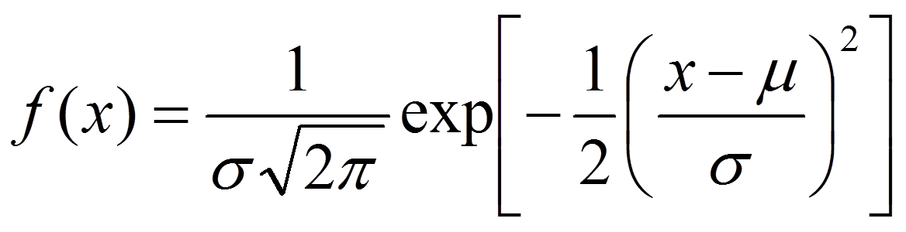

## Normal Distribution

```{r, echo=FALSE}
x <- seq(-4, 4, length = 1000)
y <- dnorm(x, mean = 0, sd = 1)
par(xaxs = "i", yaxs = "i")
plot(x, y, type = "l", lwd = 2, xlab = "Measurement", ylab = "Density", main = "Normal Distribution")
```


The Normal distribution is the most widely used distribution in Statistics, because it fits data for many natural phenomenon:  physical, mechanical, electrical, chemical, etc.  Here are just a few applications:

- Capacity variation of electrical condensers

- Tensile strength of aluminum alloy sheet

- Monthly temperature variation

- Penetration depth of steel specimens

- Rivet-head diameters

- Electrical power consumption in a given area

- Electrical resistance

- Gas molecules velocities

- Wear

- Noise generator output voltage

- Wind velocity

- Hardness

- Chamber pressure from firing ammunition

## Probability Density Function (PDF)



$\mu$ = Mean

$\sigma$ = Standard Deviation

The normal distribution is defined by its Probability Density Function (PDF).  Think of this as the probability of a variable being equal to a specific value.  It's actually more complicated than that, but don't worry about it. 

Warnings:

- Symmetric

- -$\infty$ < Values < +$\infty$

```{r, echo=FALSE}
x <- seq(0, 20, length = 1000)
y1 <- dnorm(x, mean = 10, sd = 1)
y2 <- dnorm(x, mean = 10, sd = 2)
y3 <- dnorm(x, mean = 10, sd = 3)
par(xaxs = "i", yaxs = "i")
plot(x, y1, type = "l", xlab = "Measurement", ylab = "Density", 
     main = "Normal Distribution", col = "green", lwd = 2)
lines(x, y2, col = "yellow", lwd = 2)
lines(x, y3, col = "red", lwd = 2)
legend(15, 0.25, c("sd = 1", "sd = 2", "sd = 3"), lty = c(1, 1 ,1), lwd = c(2, 2, 2), 
       col = c("green", "yellow","red"))
```

Here are 3 Normal distributions with the same mean (10), but different standard deviations (sd = 1, 2 and 3).

If you were producing a part that had a target value of 10, which distribution would you rather have?

For this distribution, if you wanted to outsource it and had to give tolerances to a supplier, where would you set them?

## Example:  Battery Life Data

40 observations of battery lives (years)

```{r}
life <- c(2.2, 4.1, 3.5, 4.5, 3.2, 3.7, 3.0, 2.6,
          3.4, 1.6, 3.1, 3.3, 3.8, 3.1, 4.7, 3.7,
          2.5, 4.3, 3.4, 3.6, 2.9, 3.3, 3.9, 3.1,
          3.3, 3.1, 3.7, 4.4, 3.2, 4.1, 1.9, 3.4,
          4.7, 3.8, 3.2, 2.6, 3.9, 3.0, 4.2, 3.5)
mean(life)
sd(life)
```

Mean $\mu$ = 3.4 years

Standard Deviation $\sigma$ = 0.7 years


Probability Density Function Plot for mean = 3.4 years and standard deviation = 0.7 years.

```{r}
x <- seq(1, 6, length = 1000)
y <- dnorm(x, mean = mean(life), sd = sd(life))
par(xaxs = "i", yaxs = "i")
plot(x, y, type = "l", lwd = 2, xlab = "Battery Life (years)", ylab = "Density", 
     main = "Battery Life PDF")
abline(v = mean(life))
```

## Cumulative Distribution Function (CDF)


For a continuous random variable, the probability that it is exactly equal to a specific value is infinitesimal.

It's easier to find the probability that it is less than or equal to a specific value.

CDF = Probability that a random variable (X) is less than or equal to a specific value (x), i.e., the area under the PDF curve to the left of the value.

```{r}
x <- seq(1, 6, length = 1000)
y <- pnorm(x, mean = mean(life), sd = sd(life))
par(xaxs = "i", yaxs = "i")
plot(x, y, type = "l", lwd = 2, xlab = "Battery Life (years)", ylab = "CDF", 
     main = "Battery Life CDF")
abline(v = mean(life))
abline(h = 0.5)
```

Here is the CDF plot for the battery life data distribution.

The value of the integral from 0 to X is plotted for all values of X in the range from 1 to 6.
